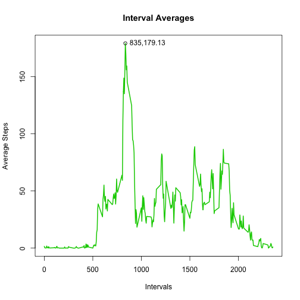

## Loading and preprocessing the data

First here are the libraries that will be required for this analysis.

```r
library(knitr)
library(ggplot2)
library(lattice)
```

To begin this analysis we start by loading the activity data provided
for the course and assigning the appropriate classes to each column.
A summary of the data follows:


```r
dat <- as.data.frame(read.csv("./activity.csv"))

dat$steps <- as.numeric(dat$steps)
dat$date <- as.Date(strptime(dat$date, format="%Y-%m-%d"))
dat$interval <- as.numeric(dat$interval)

summary(dat)
```

```
##      steps             date               interval     
##  Min.   :  0.00   Min.   :2012-10-01   Min.   :   0.0  
##  1st Qu.:  0.00   1st Qu.:2012-10-16   1st Qu.: 588.8  
##  Median :  0.00   Median :2012-10-31   Median :1177.5  
##  Mean   : 37.38   Mean   :2012-10-31   Mean   :1177.5  
##  3rd Qu.: 12.00   3rd Qu.:2012-11-15   3rd Qu.:1766.2  
##  Max.   :806.00   Max.   :2012-11-30   Max.   :2355.0  
##  NA's   :2304
```


## What is mean total number of steps taken per day?

There are 61 days of measurments at 5-minute intervals.  
I begin by creating a data frame with one row for each unique 
day of measurements.  Then I add an empty column `days$sum` 
to hold the daily sums as they are calculated in the 
following `for` loop. 


```r
days <- data.frame(day = as.Date(unique(dat$date)), sum = NA)

for(i in 1:dim(days)[1]){
    days$sum[i] <- sum(dat[dat$date == days[i,1],"steps"],na.rm=T)
    }

days$sum <- as.numeric(days$sum)
```

Now we have a data frame with totals for each day.  We can now plot the
histogram.  Even though the `barplot` function is used the bin widths
are length 1 and therefore the heights give the percantage of steps for
each day. 


```r
#png("./figure/hist01.png", height=480, width=480)
#barplot(days$sum, col="blue")
#dev.off()

barplot(days$sum, col="blue")
```

 

The mean and median of total number of steps taken each day are
presented below.


```r
mean(days$sum)
```

```
## [1] 9354.23
```

```r
median(days$sum)
```

```
## [1] 10395
```

## What is the average daily activity pattern?

The following will create a time series plot of the averages for each of
the 288 intervals measured each day.


```r
ints <- data.frame(intervals = unique(dat$int))
ints$avg <- NA
for(i in 1:length(ints$int)){
    ints$avg[i] <- 
        sum(dat[dat$int == ints$int[i],"steps"], na.rm=TRUE)/61;
    }

intMax <- ints[ints$avg == max(ints$avg),]

plot(ints$avg~ints$int, 
     type="l", 
     col=3, 
     lwd=2,
     xlab="Intervals", 
     ylab="Average Steps")
title("Interval Averages") 
points(ints[ints$avg == max(ints$avg),])
text(ints[ints$avg == max(ints$avg),],pos=4, 
        label=paste(intMax[,1],round(intMax[,2],2),sep=","))
```

 

The 835th interval has the maximum average of 179.13.


## Imputing missing values


```r
NAs <- length(which(!complete.cases(dat)))
```

There are 2304 rows with missing values in the data. 
The original data will be copied into `dat2` and the missing values 
will be imputed with the mean for that interval as computed in the
graph above.


```r
dat2 <- dat

for(i in 1:dim(dat2)[1]){
    if(is.na(dat2[i,"steps"])){
        dat2[i,1] <- ints[ints$int == dat2[i,3],2]
        }
    }
```

Now `dat2` has been imputed and we may continue with the analysis.
`days2` is constructed as before with the imputed data.


```r
days2 <- data.frame(day = as.Date(unique(dat2$date)), sum = NA)

for(i in 1:dim(days2)[1]){
    days2$sum[i] <- sum(dat2[dat2$date == days2[i,1],"steps"],na.rm=T)
    }

days2$sum <- as.numeric(days2$sum)
```


```r
#png("./figure/hist02.png", height=480, width=480)
#barplot(days2$sum, col="blue")
#dev.off()

barplot(days2$sum, col="blue")
```

 

### Comparing original data with imputed data.

To compare the two histograms we plot them in a column, the imputed data
is colored green.


```r
par(mfrow=c(2,1))
barplot(days$sum, col="blue")
barplot(days2$sum, col="darkgreen")
```

 

## Are there differences in activity patterns between weekdays and weekends?

For this section we will be using the imputed data.   I create a
function to aid in catagorizing the days of the week into a factor
variable with levels `weekday` and `weekend`.  


```r
weekday <- setdiff(unique(weekdays(dat2$date)), c("Saturday", "Sunday"))
weekend <- c("Saturday", "Sunday")

## function for lapply later
trans <- function(x){
    if(x %in% weekday){return("weekday")}
    else return("weekend")}
## end function

## Add day of week and weekday/weekend to the data.frame
dat2$dow <- as.factor(weekdays(dat2$date))
dat2$wdwe <- factor(sapply(weekdays(dat2$date),trans))
```


```r
intsWD <- data.frame(intervals = rep(unique(dat2$int),2))
intsWD$avg <- NA
intsWD$wd <- gl(2,dim(intsWD)[1]/2, labels=wdwe)

for(i in 1:length(intsWD$int)){
    intsWD$avg[i] <- 
        mean(dat2[dat2$int == intsWD$int[i] 
             & dat2$wdwe == intsWD$wd[i],]$steps)
    }
```


From these data, a panel plot will be produced to compare and contrast the
averages accross weekday and weekend measurements.


```r
p4 <- xyplot(intsWD$avg ~ intsWD$int | intsWD$wd,
       main = "Weekday/Weekend",
       type="l", 
       layout=c(1,2),
       xlab=c("Interval"),
       ylab=c("Average Step Count"));
```

#### Differences can be seen between the two panels both in the morning and thoughout the day. 


```r
p4
```

 
